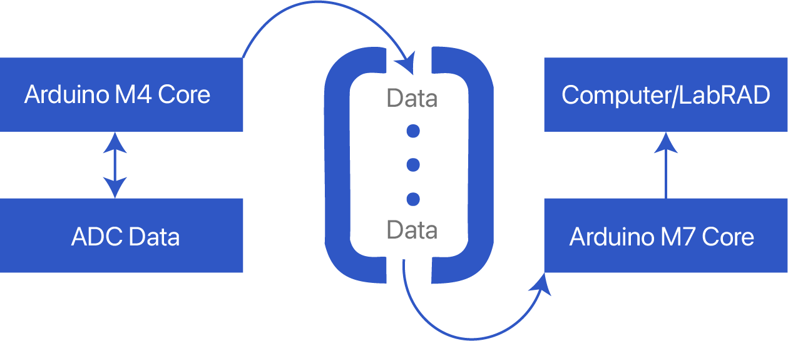

# GateKeeper Firmware

[](LICENSE)

Firmware for sp2 Quantum GateKeeper. New features include precise timings (<300ns error) for SPI comms, new buffer ramp options, and data acquisition being in-tandem with transmission to LabRAD.

The firmware is designed to be easily extensible, as new peripherals can simply be added with little consideration for how other peripherals are written, as operations are all added independently to a centralized registry.

**If you have any questions**, feel free to email [markzakharyan@sp2quantum.com](mailto:markzakharyan@sp2quantum.com)

<!--
## Table of Contents

- [Installation](#installation)
- [Usage](#usage)
- [License](#license)
-->

## Installation

1. Unzip Firmware_Package.zip (from the releases tab)

2. Make sure you have `dfu-util` installed

  - **Linux (Debian)**: `sudo apt install dfu-util`
  - **MacOS**: `brew install dfu-util`
  - **Windows**:
    - Download [dfu-util](https://dfu-util.sourceforge.net) to your local system, e.g., under `D:\dfu-util`.
    - Rename it to `dfu-util.exe`.
    - Append the path of the `dfu-util.exe` to the system environment variable PATH.

3. Run `pip install -r requirements.txt`

4. Plug in Arduino Giga

5. Run `python3 upload_firmware.py`

You can also build/upload from source:

This firmware has one root PlatformIO entrypoint plus separate M4 and M7 core projects. The root default environment is `gatekeeper_firmware`, so normal development uploads do not need an explicit `-e` selection. From the repo root, run:

```sh
pio run -t upload
```

This uploads the complete firmware bundle over USB DFU: USB gateway M4, then worker M7 firmware. To build the same bundle without uploading, use:

```sh
pio run
```

The `m4/` and `m7/` folders remain normal PlatformIO projects for core-specific development and debugging.

Install the test dependencies and run the hardware-independent suite with:

```sh
python -m pip install -r tests/requirements.txt
python -m pytest -m "not hardware"
```

With DAC channel `i` connected to ADC channel `i`, the complete suite is:

```sh
python -m pytest
```

Use `--port=COM8` to override automatic device detection. Firmware uploads run
the read-only `post_flash_health_checks` automatically; they do not assume
loopback wiring or change DAC outputs. See `tests/README.md` for test safety and
markers.

## Usage

For general GateKeeper usage / theory of operation docs, read the [GateKeeper Docs](https://sp2quantum.web.app/docs/). This README describes the firmware structure itself.

Note for vim users: If you have any issues with linting/LSP with (neo)vim then try running `python3 platformio_tools/update_compile_commands.py` from the firmware root.

**Features of this firmware include:**

- **Function Registry / user IO handling completely separate from all peripheral logic**
  - This means you can add/modify peripheral logic without regard for how the firmware processes commands. Simply write your logic and register commands with the Function Registry
- **Precise timings**
  - Framework to trigger events at a specified frequency, with error ~100ns. We use this to communicate with the DAC/ADC at very precise intervals in buffer ramps
- **Dual Core**
  - Utilizes both M4 and M7 cores of the Arduino Giga, which allows parallel data collection and transmission to a measurement computer, which saves a *substantial* amount of time during long buffer ramps (~25% faster).
- **New native buffer ramp options**
  - DAC-led ramp now allows for precise control over DAC settling time
  - Time series buffer ramp allows for spectral analysis of data after collection with LabRAD
  - Native 2D buffer ramp along any arbitrary axis in DAC voltage phase space
  - Boxcar buffer ramp

### Known Issues

- There are currently no known issues! Please file an issue report if you find a bug.

### Extending Firmware

Add a command by writing a normal `OperationResult` function and placing
`COMMAND` right below it. Argument parsing and argument count checking are
inferred from the function signature.

```cpp
#include "FunctionRegistry/FunctionRegistryHelpers.h"

OperationResult setThing(int channel, float value) {
  return OperationResult::Success();
}
COMMAND("SET_THING", setThing)
```

For variable-length arguments, use `List<T, N>` where `N` is the earlier scalar
argument that gives the list length. `List<float, 0, 2>` reads `arg0 * arg2`
values.

```cpp
using FunctionRegistryParsing::List;

OperationResult exampleRamp(int numDacs, List<int, 0>& channels,
                            List<float, 0>& voltages) {
  return OperationResult::Success();
}
COMMAND("EXAMPLE_RAMP", exampleRamp)
```

Use `ON_SETUP(func)` for work that happens once at boot, before user commands are
handled: pin modes, hardware objects, default runtime state, etc. Use
`ON_SETUP_PLATFORM` for lower-level platform setup and `ON_SETUP_CALIBRATION` for
applying saved calibration after hardware setup. For example:

```cpp
void setup() {
  DACLimits::initializeLimits();
  initChannelDefaults();
  pinMode(ldac, OUTPUT);
  FastGpio::digitalWrite(ldac, true);
}
ON_SETUP(setup)
```

Use `ON_INITIALIZE(func)` for work that should happen only when the user sends
`INITIALIZE`/`INIT`, such as taking a peripheral out of a safe startup state. Below is an example from `DACController.cpp`. `ON_SETUP` configures the pins and
`INITIALIZE` takes the AD5791 DACs out of tri-state and sets them to zero.

```cpp
void initialize() {
  for (int i = 0; i < NUM_DAC_CHANNELS; i++) {
    byte buf[3] = {kWriteControlRegisterCommand, 0, kUnclampDacFromGround};
    comms[i].transferDAC(buf, 3);
    setVoltage(i, 0.0);
  }
}
ON_INITIALIZE(initialize)
```

If a peripheral has saved calibration, define its private calibration struct in
that controller and register it with `CALIBRATION_SECTION`. The root calibration
service handles flash persistence and default reset; `main.cpp` does not need to
know the peripheral exists. For example:

```cpp
struct DacCalibrationData {
  float gain[NUM_DAC_CALIBRATION_CHANNELS];
  float offset[NUM_DAC_CALIBRATION_CHANNELS];
};

void setDacCalibrationDefaults(void* section) { /* ... */ }
bool validateDacCalibration(const void* section) { return true; }

CALIBRATION_SECTION("DAC", DacCalibrationData, setDacCalibrationDefaults,
                    validateDacCalibration)
```

### Precise Timings (Hardware Timers)

Precise timings are achieved by using separate hardware timers for the DAC and ADC and configuring the Arduino Giga to trigger an interrupt service routine (ISR) when a timer's register exceeds a certain value. All timing-related things are handled in `TimingUtil.h`, which mostly contains register configurations to setup the hardware timers properly. TIM1 is used for the DAC and TIM8 is used for the ADC.

After setting up a timer using TimingUtil (for example, by calling `setupTimersTimeSeries(dac_period_us, adc_period_us)`), `TimingUtil::dacFlag` and `TimingUtil::adcFlag` are set to true constantly after a given period. What's expected is a loop to constantly check if one of these flags is `true`, execute something, and set that flag to false.

**Important:** None of the timers in TimingUtil automatically stop, and the function that calls a TimingUtil function must recognize when the timers have triggered enough times and call `TimingUtil.disableDacInterrupt()` and/or `TimingUtil.disableAdcInterrupt()`

The two modes we have for precise timings are Time Series, and DAC-Led. Time Series simply triggers both the `dacFlag` and `adcFlag` at their respective intervals, starting at the same time. DAC-Led triggers both the `dacFlag` and `adcFlag` at the same frequency (`dac_interval_us`), with a phase difference between them (`dac_settling_time_us`)

### SPI Comms

#### Simultaneity

When two events occur at the same time, the following behavior occurs:

- DAC SPI is sent before ADC SPI.
- ADC channels on separate ADC boards can convert simultaneously.
- ADC channels on the same ADC board are serviced sequentially in channel order.
- Timing checks should be based on the slowest active ADC board: sum the conversion times for channels selected on each board, then use the maximum board total plus firmware/SPI overhead.

### Dual Core Comms

This firmware utilizes both the M4 and M7 cores of the Arduino Giga R1. By default, the M7 core is booted and the M4 is initialized *on the M7*.

The purpose of using a dual-core approach is to separate USB host communication from peripheral timing work. The M4 owns USB CDC and forwards host commands through shared memory. The M7 boots the M4, owns the DAC/ADC hardware, and executes the peripheral workload. This keeps USB/serial handling away from timing-critical SPI execution.

The Gatekeeper shield's data LED is driven by the M4 because that core owns the
USB CDC endpoints. A completed, nonempty USB transmit or receive keeps the LED
on for at least 30 ms so individual packets are visible. Continuous traffic
keeps it illuminated. The indication is generated from USB endpoint callbacks,
not from command execution or shared-memory traffic, so queued or dropped host
responses do not create false activity.

If you Google the docs for how to implement dual-core communications between the M4 and M7 cores, it tells you to use RPC. **We do not do this!** RPC is slow for our purposes and completely screws up our precise timings for the same reason why Serial messes them up. Instead, we manually initialize the M4 core ourselves (instead of with RPC) and use a circular shared memory buffer that both the M4 and M7 have access to. We initialize the M4 core ourselves (instead of with `RPC.begin()`).

Shared memory contains a byte-stream command buffer from M4 to M7 and separate
text, float, and voltage response buffers from M7 to M4. Each circular buffer
works like this:


This diagram shows how ADC voltages are collected and transmitted to the host
during a ramp.

Voltage samples are converted to 32-bit IEEE-754 floats and transmitted over
USB in little-endian byte order. This is significantly faster than formatting
each voltage as text, so buffer ramps use this binary stream.

### Buffer Ramps

#### Minimum Timing Tables

Normal ramp commands reject known-unsafe timing parameters before starting the
ramp. `_SUDO` commands use the same arguments but skip only these timing guards;
channel validation, voltage bounds, and argument validation still run.

For normal commands, a timing-watchdog failure during or after a ramp is a
firmware bug unless the command was `_SUDO` or `BOXCAR_BUFFER_RAMP` (whose
floor is necessary but not sufficient; see the boxcar table notes below).
Non-timing failures, such as a host not reading fast enough from the finite
output buffer, can still occur at run time.

All values below are microseconds. The validation minimums are
conversion-time dependent: they are computed from the *actual* conversion
times currently configured on the selected ADC channels (`CONVERT_TIME`) at
the moment the ramp command is validated.

The key quantity is the **busiest-board conversion sum** `S`: for each ADC
card, sum the actual conversion times of the selected channels on that card;
`S` is the largest such sum. Channels on the same card share one converter
that scans them round-robin, so each channel only produces a fresh sample
every `S` microseconds. `n` below is the total number of selected ADC
channels and `D` is the number of DAC channels.

The timing constants were calibrated against hardware on 2026-07-03 by
sweeping `_SUDO` ramps until the SPI/conversion watchdogs tripped or loopback
data contained stale (bit-identical) samples. The DAC-led distinct-averaging
rule combines those measured conversion, register-read, and latch margins.
Raw data and fits are in `test_outputs/timing_calibration_20260703/`.

| Command | Checked parameter | Minimum |
| --- | --- | --- |
| `DAC_LED_BUFFER_RAMP` (1D and 2D) | `dac_interval_us` | `settling + numAdcAverages*S + 15*n + 27` |
| `DAC_LED_BUFFER_RAMP` (1D and 2D) | `dac_settling_time_us` | `20`; must also be less than `dac_interval_us` |
| `TIME_SERIES_BUFFER_RAMP` | `adc_interval_us` | `max(1D table floor, ceil(S) + 15)` |
| `2D_TIME_SERIES_BUFFER_RAMP` | `adc_interval_us` | `max(mode table floor, ceil(S) + 15)` |
| `TIME_SERIES_ADC_READ` | `conversion_time_us` | `82` (it sets the conversion times itself) |
| `AWG_BUFFER_RAMP` | `dac_interval_us` | `20` for 1-4 DAC channels; `40` for 5-8 DAC channels |
| `AWG_WITH_ADC` | `dac_interval_us` | `S + 15*n + 5*D + 25` |
| `BOXCAR_BUFFER_RAMP` | `adc_conversion_time_us` | `max(82,` boxcar table`)` |

Why each rule looks the way it does:

- **Time series**: `adc_interval_us` is only a sampling clock; the ADCs
  free-run at their configured conversion times. Sampling faster than the
  busiest board updates does not fail loudly - it silently duplicates stale
  samples (measured duplicate fraction is exactly `1 - interval/S`). The
  fixed `+15us` margin covers jitter in individual conversion-update spacing
  (a fine offset scan measured duplicate-free sampling by `S + 8us` at every
  conversion time from 82us to 5.2ms, so the required margin does not grow
  with `S`). The per-mode table floors below still apply at fast conversion
  settings.
- **DAC-led**: each cycle is LDAC latch, settle, then collect
  `numAdcAverages` distinct ADC conversions while the DAC point remains fixed.
  Each selected channel is read once per conversion round and the resulting
  samples are averaged into one output frame. Register reads cost about 15 us
  each; the final `+27 us` combines readout and latch margin. For more than one
  average, one round of ADC register reads must also fit inside the selected
  ADC-board conversion sum so continuous-conversion results cannot be skipped.
- **AWG_WITH_ADC**: one conversion per DAC step plus readout and per-channel
  DAC writes.

`_SUDO` aliases run the same ramp without these pre-checks (channel, voltage
bound, and argument validation still apply): `DAC_LED_BUFFER_RAMP_SUDO`,
`2D_DAC_LED_BUFFER_RAMP_SUDO`, `TIME_SERIES_BUFFER_RAMP_SUDO`,
`2D_TIME_SERIES_BUFFER_RAMP_SUDO`, `TIME_SERIES_ADC_READ_SUDO`,
`AWG_BUFFER_RAMP_SUDO`, `AWG_WITH_ADC_SUDO`, and
`BOXCAR_BUFFER_RAMP_SUDO`.

The time-series table floors below are empirical minimums for the selected
ADC-board split, measured at the fastest conversion setting
(`CONVERT_TIME,ch,82`, about `82.03125us` actual); at slower conversions the
`ceil(S) + 15` term dominates. Rows are selected ADC channels on the
busiest ADC card; columns are selected channels on the second-busiest card.
With the current 2-ADC-board hardware, an 8-channel read is row `4`, column
`4`.

`TIME_SERIES_BUFFER_RAMP` minimum `adc_interval_us`:

| Busiest ADC card \ second-busiest | 0 | 1 | 2 | 3 | 4 |
| --- | ---: | ---: | ---: | ---: | ---: |
| 0 | - | 80 | 80 | 100 | 160 |
| 1 | 80 | 80 | 80 | 80 | 160 |
| 2 | 80 | 80 | 80 | 180 | 140 |
| 3 | 100 | 120 | 120 | 200 | 240 |
| 4 | 160 | 160 | 300 | 240 | 160 |

`2D_TIME_SERIES_BUFFER_RAMP` minimum `adc_interval_us`, normal mode:

| Busiest ADC card \ second-busiest | 0 | 1 | 2 | 3 | 4 |
| --- | ---: | ---: | ---: | ---: | ---: |
| 0 | - | 105 | 102 | 150 | 131 |
| 1 | 105 | 119 | 107 | 156 | 204 |
| 2 | 102 | 107 | 114 | 163 | 208 |
| 3 | 150 | 156 | 163 | 171 | 434 |
| 4 | 131 | 204 | 208 | 434 | 452 |

`2D_TIME_SERIES_BUFFER_RAMP` minimum `adc_interval_us`, retrace mode:

| Busiest ADC card \ second-busiest | 0 | 1 | 2 | 3 | 4 |
| --- | ---: | ---: | ---: | ---: | ---: |
| 0 | - | 105 | 102 | 151 | 197 |
| 1 | 105 | 119 | 107 | 156 | 204 |
| 2 | 102 | 107 | 114 | 163 | 208 |
| 3 | 151 | 156 | 163 | 171 | 434 |
| 4 | 197 | 204 | 208 | 434 | 448 |

`2D_TIME_SERIES_BUFFER_RAMP` minimum `adc_interval_us`, snake mode:

| Busiest ADC card \ second-busiest | 0 | 1 | 2 | 3 | 4 |
| --- | ---: | ---: | ---: | ---: | ---: |
| 0 | - | 107 | 101 | 148 | 131 |
| 1 | 107 | 119 | 107 | 156 | 204 |
| 2 | 101 | 107 | 114 | 164 | 209 |
| 3 | 148 | 156 | 164 | 170 | 442 |
| 4 | 131 | 204 | 209 | 442 | 454 |

`BOXCAR_BUFFER_RAMP` minimum `adc_conversion_time_us` (busiest ADC card
channel count x second-busiest):

| Busiest ADC card \ second-busiest | 0 | 1 | 2 | 3 | 4 |
| --- | ---: | ---: | ---: | ---: | ---: |
| 1 | 160 | 82 | - | - | - |
| 2 | 120 | 120 | 200 | - | - |
| 3 | 200 | 200 | 200 | 200 | - |
| 4 | 300 | 800 | 300 | 300 | 1600 |

The boxcar floor is **necessary but not sufficient**: the boxcar readout
phase-locks against the conversion timer, so whether a given conversion time
runs misstep-free is not monotonic (for example the 4/4 split runs cleanly at
`1600` but missteps at `2000`), and values near the floor can misstep
depending on startup phase. The table holds the exact hardware-verified
minimums below which failures are deterministic; the run-time watchdog
reports `adc_spi_missteps` honestly for anything above it, so prefer
conversion times comfortably above the floor and treat a misstep report as a
cue to adjust the conversion time.

## License

This project is licensed under the [MIT License](LICENSE).
